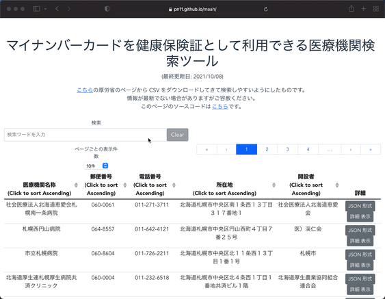

# MaaH: My number card as a Health insurance card



マイナンバーカードを健康保険証として利用できる医療機関を検索できるツールです。以下の厚労省のページから CSV をダウンロードしてきて使っています。

- [マイナンバーカードの健康保険証利用対応の医療機関・薬局についてのお知らせ（国民向け） | 厚生労働省](https://www.mhlw.go.jp/stf/index_16743.html)

## Developer's Info

### Project setup

```sh
npm install
```

### Compiles and hot-reloads for development

```sh
npm run serve
```

### Compiles and minifies for production

```sh
npm run build
```

### Lints and fixes files

```sh
npm run lint
```

### CSV を JSON に変換

```sh
npm run csvtojson
```

厚労省の CSV が Shift-JIS のため、 UTF-8 にしてから JSON に変換している。

### BootstrapVue に関して

- [Table | Components | BootstrapVue](https://bootstrap-vue.org/docs/components/table) の [#Complete Example](https://bootstrap-vue.org/docs/components/table#complete-example) から要らないものを削った。
- テーブルデータが多いと filter の応答が遅くなるのは [debounce](https://bootstrap-vue.org/docs/components/form-input#debounce-support) を 500 ms に設定することで解決した (via [table filter super slow · Issue #4211 · bootstrap-vue/bootstrap-vue](https://github.com/bootstrap-vue/bootstrap-vue/issues/4211))。デフォルトではこの値は0になっていて、文字を打ち込む度に検索がかかってしまうので応答が遅くなる。
